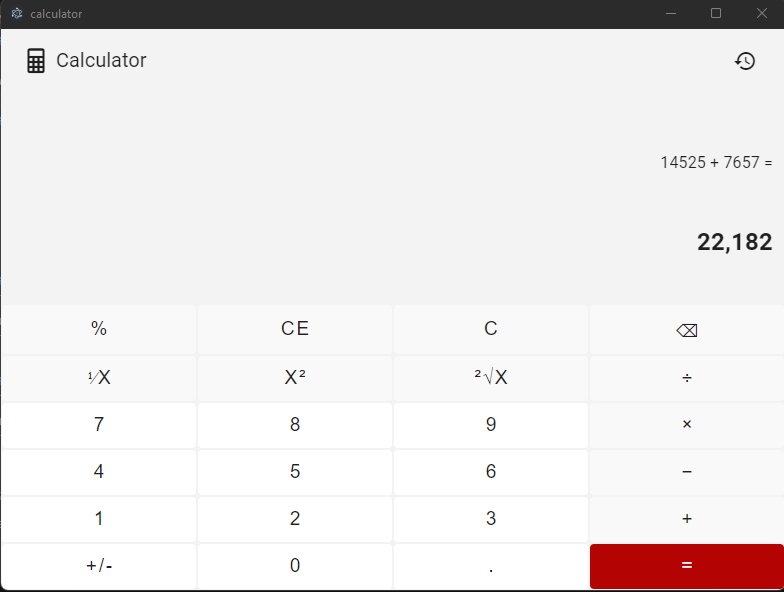
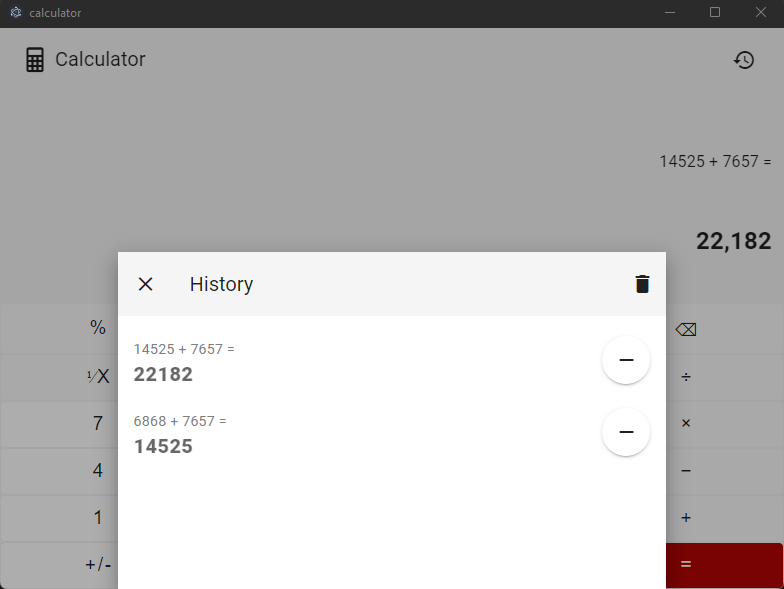

# Vue Calculator App

A simple, responsive calculator app built with Vue.js,Vuex, Vuetify and electron.js.

## App SS

### Main


### History


## Features

- Basic arithmetic operations: addition, subtraction, multiplication, and division.
- Advanced operations: percentage, reciprocal, square, square root.
- History of calculations with the ability to reuse previous results.
- Keyboard support for input.
- Responsive design for various screen sizes.

## Project setup
```
npm install
```

### Compiles and hot-reloads for development
```
npm run electron:serve
```

### Compiles and minifies for production
```
npm run electron:build
```

### Lints and fixes files
```
npm run lint
```

### Customize configuration
See [Configuration Reference](https://cli.vuejs.org/config/).


## Components
### App.vue

The root component that sets up the main structure of the application.

### TheCalculator.vue

The main calculator component that handles user input and displays the calculator interface.

### BaseButton.vue

A reusable button component used for the calculator keys.

### HistoryDialog.vue

A component to display the history of calculations.

## Mixins

### calculator.js

Handles the calculator logic and state management.

## Scripts

- `main.js`: The entry point of the application.
- `variables.js`: Contains button configurations and keyboard input mappings.

